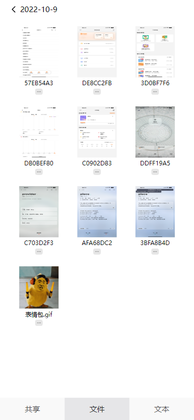
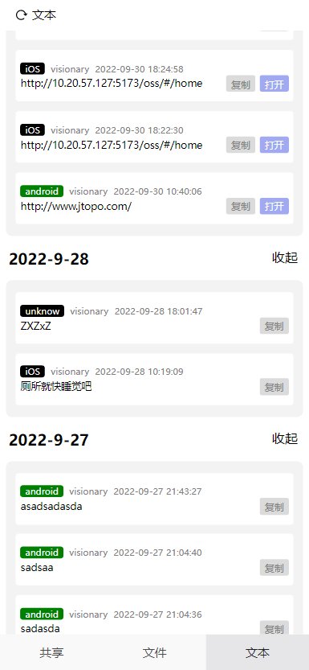

# 一个用于局域网多设备文件、图片、文本共享的服务前端(移动端H5)

### 1. 功能介绍

1. 使用到的技术栈: Vue 3 + TypeScript + Vite:
   实现了文件、图片、文本的共享，需要配合后端才能使用。
2. 需要自行修改项目代码的需要克隆本项目，不需要的话直接使用[本项目的服务端](https://github.com/plas007/OSS-Service.git "跳转服务端仓库")(包含本项目打包后的内容)代码。

### 2. 使用方法

1. 需要clone本项目到本地

   ```shell
   git clone https://github.com/plas007/OSS-Share.git
   cd OSS-Share
   ```
2. 安装依赖

   ```shell
   npm install
   ```
3. 开发模式

   ```shell
   npm run dev
   ```
4. 打包模式

   ```shell
   npm run build
   ```
5. 打包并发布模式

   ```shell
   npm run build-public
   ```

   *这里需要注意发布是将打包的内容防止到服务器端,需要手动修改publish.sh脚本地址*

   ```shell
   #!/bin/sh
   rm -rf "../OSS-Service/public/oss"
   cp -r "./dist/" "../OSS-Service/public/oss"
   ```

### 3. UI界面





